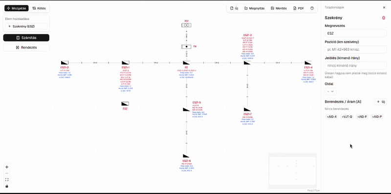
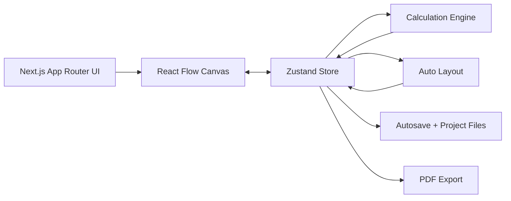

# LV Network Design & Sizing Tool

A browser-based engineering tool for designing and calculating low-voltage distribution networks using an interactive schematic canvas.

[Live Demo](https://lv-network-design-sizing-tool.vercel.app/) (production, `main`)



> Engineering prototype for demonstration purposes. Calculations should be independently verified before use in real-world electrical designs.

## Deploy & Staging

The app is hosted on [Vercel](https://vercel.com), linked to the GitHub repo.

| Branch    | Environment | URL |
| --------- | ----------- | --- |
| `main`    | Production  | [lv-network-design-sizing-tool.vercel.app](https://lv-network-design-sizing-tool.vercel.app/) |
| `staging` | Staging     | Preview URL for the `staging` branch (see below) |

### Give `staging` a stable URL

1. Push to `staging` (already exists on GitHub).
2. Open the Vercel project → **Deployments** and confirm a Preview deployment ran for `staging`.
3. Project → **Settings** → **Domains** → **Add**:
   - Domain: `staging-lv-network-design-sizing-tool.vercel.app` (or your own subdomain)
   - Assign it to the **`staging`** Git branch
4. After that, every push to `staging` updates that URL; `main` stays production.

Workflow: develop on a feature branch → merge to `staging` for review → merge `staging` into `main` for production.

## Overview

The LV Network Design & Sizing Tool lets users build a low-voltage (0.4 kV) underground cable network as an interactive node diagram.

Users can add a utility supply, a main meter, a main distributor, and roadside distribution cabinets, connect them with cables, assign device loads, and calculate:

- Required cable cross-section, plus a recommended standard size graded across the whole network
- Segment and cumulative voltage drop, in both volts and percent
- Cumulative loop impedance and short-circuit current at every cabinet
- Suggested maximum fuse rating at every cabinet
- Downstream current across the network, optionally scaled to a design current with a configurable safety factor

Projects can be automatically arranged, saved locally or exported to a file, and printed as a PDF schematic.

"Downstream current across the network" is the key detail: the engine does not calculate each cable in isolation. It builds the connected graph, determines parent/child relationships from the utility supply, and accumulates loads and voltage drop through the whole network as it walks outward.

## What I Built

- An interactive node-based electrical schematic editor
- Custom nodes and cable connections built on React Flow
- A graph-based calculation engine that propagates electrical loads and accumulates voltage drop and loop impedance along the full path from the source through the network
- An optional "design current" mode that scales downstream loads by a configurable safety factor, mirroring how the reference spreadsheet sizes cables
- Full-network automatic layout with uniform spacing and collision-aware label positioning for both node and cable labels
- Cable sizing, voltage-drop, loop impedance, short-circuit current, and maximum fuse rating calculations
- A recommended standard cross-section per cable, graded across the network and shown on the diagram
- Editable property panels for every network element and cable, including custom cable names/designations
- Project autosave to localStorage, so a refresh never loses work
- Import and export using a custom `.wire.json` project file format
- Print-ready PDF export with a diagram legend and per-cable field toggles
- Full Hungarian and English localization
- A verification script that checks the engine's output against a reference Excel spreadsheet
- An `AGENTS.md` guide so AI coding agents (Claude, Cursor, Codex, etc.) can work in this repo safely

## Architecture



The canvas (React Flow) only renders whatever is in the Zustand store. Every user action (adding an element, drawing a cable, editing a property, running Calculate, clicking Auto-layout) mutates the store, which triggers the calculation engine and re-renders the diagram. Nothing about the electrical math lives inside a React component.

## Calculation Engine

The electrical calculation logic is implemented separately from the interface in `lib/calculations.ts`, with graph helpers in `lib/downstream.ts`.

The engine treats the network as a graph rooted at the utility supply node:

1. It builds an adjacency list from the cable edges.
2. It runs a breadth-first traversal from the supply node to establish parent/child direction for every element.
3. It walks the tree in post-order, aggregating each cabinet's own device load with everything downstream of it, so every cable carries the total current of everything it feeds. If the supply node's "design current" option is enabled, downstream totals are scaled by an editable safety factor (device total x factor / number of phases, factor defaults to 1.2) instead of using the raw summed device current. Individual cables can also opt out of that scaling and keep carrying the raw total.
4. It walks the tree again in pre-order, calculating each cable's sizing, voltage drop, and loop impedance from that current, and accumulating both voltage drop and loop impedance from the source outward, cable by cable, along the full path to each node (not just the last cable feeding it).
5. Cabinet nodes are annotated with their own load, total downstream load, cumulative voltage drop (in volts and as a percentage), the cumulative loop impedance and short-circuit current for the full path back to the source, and the suggested maximum fuse rating at that point.
6. Finally it recommends a standard cross-section for every cable (see below).

### Recommended Cross-Sections

The recommended size is optional on the wire label: tick **Recommended** in the cable's displayed-values list. It is green when the size currently set is adequate and amber when it is too small.

The engine solves the recommendation for the whole network from topology, lengths, and currents only. Installed sizes are not an input, so setting every cable to its recommended size is a network that stays inside the limits, and re-running the engine repeats the same numbers.

The steps are:

1. **Thermal floor**: every cable starts at the next standard size above `I / maxCurrentDensity` (default 2 A/mm² on the utility-supply node; set to 0 to disable), or at the smallest standard size if density is off. This is a single editable current-density number, not a full ampacity table (cable type, installation, soil, and grouping are not modelled).
2. **Cumulative voltage drop**: while any cabinet's path drop in volts exceeds the allowed reference drop on its incoming cable, step up the one path cable that buys the most volts for a single standard size. Widening the biggest contributor first keeps the taper the network already has, rather than dumping the whole correction on the last cable.
3. **Grading**: a cable is never thinner than any cable it feeds, so cross-sections taper away from the source and never step up. Applied last, so a trunk that only needed a small size for its own drop is still raised if it feeds a thicker branch.

The Excel per-cable formula `A = ρ L I / é` (with `é = 0.75 × U × ε / √3` on three-phase) is kept as `requiredCrossSection` and shown in the property sidebar as the required minimum. It is not what the recommendation rounds up from, and it is not shown on the wire label. `networkRequiredCrossSection` is an internal continuous need and is also not shown on the label.

The recommendation is advice, not an automatic edit: cross-sections are only ever changed by editing a cable.

### Calculated Values

For each cable segment, the engine calculates:

- Total carried current (optionally as a design current)
- Required minimum conductor cross-section
- Recommended standard cross-section (graded across the network)
- Voltage drop in volts
- Voltage drop as a percentage
- Loop impedance
- Short-circuit current

Cabinet nodes also display their own load, downstream load, the cumulative loop impedance and short-circuit current for the whole path back to the supply, and the suggested maximum fuse rating derived from that short-circuit current. Cumulative voltage drop is shown as a single compact line, volts and percent together against the allowed limit, e.g. `Voltage drop: 7.20 V • 1.80% / 4.00% ✓` (a warning mark and amber colour instead of the checkmark when the path is over the allowed limit). Numbers use a decimal comma in Hungarian and a decimal point in English.

The engine supports both three-phase (400 V) and single-phase (230 V) systems, since the underlying formulas and conductor factors differ between the two.

### Example Formulas

Three-phase voltage drop:

```text
ΔU = sqrt(3) x rho x L x I / A
```

Loop impedance (go + return path):

```text
Z = 2 x rho x L / A
```

Short-circuit current:

```text
Isc = 230 V / Z
```

Design current, when the utility-supply node's design-current option is enabled:

```text
I_design = (raw device total x safety factor) / number of phases
```

The safety factor defaults to 1.2 but is editable per project, and any individual cable can be flagged to skip it and carry the raw total instead.

Suggested maximum fuse rating:

```text
I_fuse = Isc / 8
```

Where `L` is cable length, `A` is conductor cross-section, `I` is current, and `rho` is the resistivity of aluminium conductor (the only material this tool models, matching the reference calculation). The reference spreadsheet labels loop impedance, short-circuit current, and fuse rating as Rh, Iz, and Bizt.

## Calculation Verification

The calculation engine is verified against existing Excel-based reference calculations: the `3F` and `1. körzet` sheets of `UHK szamitas pelda.xlsx`, and `examples/UHK szamitas_Rack_v1.xlsx` (which fixes the design current factor and cumulative impedance accumulation).

The verification harness in `scripts/verify-calculations.ts` rebuilds each reference network as nodes and edges, runs the production `runCalculations` engine (the exact same code path the app uses), and compares the output against the cached values Excel itself computed, using numerical tolerances. It also documents which Excel summary cells are known to be wrong (due to a shifted column) so the harness doesn't chase a bug in the spreadsheet instead of the engine.

Verified values include:

- Downstream current, including design current mode
- Required cable cross-section
- Voltage drop in volts and as a percentage, per cable and cumulative
- Loop impedance, per cable and cumulative
- Short-circuit current
- Suggested maximum fuse rating

Run the verification:

```bash
pnpm verify:calc
```

## Features

- **Interactive canvas**: drag, pan, and zoom a node-based schematic diagram
- **Network elements**: Utility Supply (US), Main Meter (MM), Main Distributor (MD), and feeder pillars (FP). Saved projects still store the Hungarian abbreviations (ÁSZ, FM, FE, ESZ); the English UI displays the English ones.
- **Wire mode**: connect elements with cables by switching modes, and optionally name each cable
- **Auto layout**: re-flow the whole network from the supply node with uniform, collision-avoiding spacing
- **Calculations**: cable sizing, voltage drop, cumulative loop impedance, short-circuit current, and maximum fuse rating across the whole network, with an optional design-current mode
- **Save & open**: save projects to a file, with automatic localStorage autosave that survives refreshes
- **PDF export**: export the drawing to a print-ready PDF with a legend, with per-cable control over which calculated values are shown
- **Bilingual**: full Hungarian / English UI. English uses US, MM, MD, FP, and Isc; Hungarian uses ÁSZ, FM, FE, ESZ, and Iz. Decimals follow the active language (comma vs dot).
- **Property editor**: select any element or cable to inspect and edit its data and computed values, all consistently formatted to 3 decimal places with units

## Tech Stack

| Layer     | Library                                                                                               |
| --------- | ----------------------------------------------------------------------------------------------------- |
| Framework | [Next.js 16](https://nextjs.org)                                                                      |
| Canvas    | [React Flow](https://reactflow.dev)                                                                   |
| State     | [Zustand](https://zustand-demo.pmnd.rs)                                                               |
| UI        | [shadcn/ui](https://ui.shadcn.com) + Tailwind CSS                                                     |
| PDF       | [jsPDF](https://github.com/parallax/jsPDF) + [html-to-image](https://github.com/bubkoo/html-to-image) |
| Language  | TypeScript                                                                                            |

## Design Decisions

### React Flow for the schematic

React Flow provides node positioning, connections, keyboard navigation, pan, and zoom behavior out of the box, while still allowing every electrical element to be a fully custom component with its own schematic symbol and ports.

### Zustand for editor state

The complete network model (nodes, edges, canvas mode, selection) is stored centrally, so the canvas, the property editor, the calculation engine, the autosave system, and the PDF exporter all read and write the same node and cable data.

### Calculation logic separated from the UI

Electrical formulas and graph traversal live in plain TypeScript modules under `lib/`, not inside React components. This makes the engine easy to verify, test, and reuse independently of the interface, which is exactly what `scripts/verify-calculations.ts` does.

### File-based project persistence

Projects can be exported and opened as a `.wire.json` file without requiring user accounts or a backend database. Automatic localStorage persistence also protects work in progress from accidental refreshes.

### Agent-ready repository

`AGENTS.md` documents the domain terms, commands, and safety rules (especially "never touch the calculation engine without re-running `pnpm verify:calc`") that an AI coding agent needs to make correct, low-risk changes to this codebase.

## Project Structure

```
app/          # Next.js App Router pages and layout
components/
  flow/       # Canvas, custom nodes, cable edges, sidebar, toolbar
  ui/         # shadcn/ui primitives
lib/          # Calculation engine, graph traversal, auto-layout, PDF export,
              # project file I/O, i18n
store/        # Zustand stores (network data, UI settings)
types/        # TypeScript types for electrical nodes and edges
scripts/      # Excel-verification harness for the calculation engine
examples/     # Sample .wire.json project files
docs/         # README assets
```

## Local Setup

```bash
# Install dependencies
pnpm install

# Start the development server
pnpm dev

# Run the calculation engine against the Excel reference
pnpm verify:calc

# Lint
pnpm lint

# Production build
pnpm build
```

Open [http://localhost:3000](http://localhost:3000) in your browser.

## Limitations & Future Improvements

- The demo UI currently defaults to Hungarian; a browser-language-aware default with a persisted toggle is a planned improvement.
- The verification script is a standalone harness, not yet wired into `pnpm test` or CI. Porting it to Vitest and adding a GitHub Actions workflow is the next step toward a fully production-grade pipeline.
- Only aluminium conductors are modeled, matching the reference calculation this tool was built against.
- Auto layout uses a fixed breadth-first spacing rule rather than a general-purpose graph-layout algorithm; a full graph-layout pass (e.g. Dagre/ELK) would help with very large or irregular networks.
